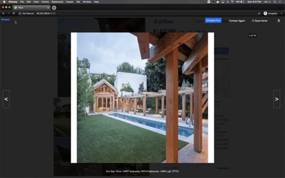

# Wandur - Reviews


You can find the [full video demo here](https://www.youtube.com/watch?v=eAB0KqyrN1I).

## Related Projects

  - https://github.com/shintung00/AK-service
  - https://github.com/shintung00/sb-service
  - https://github.com/shintung00/JD-service


## Getting Started
Prerequisites: Node 6 or above

You can use [nvm](https://github.com/creationix/nvm#installation) to easily switch Node versions.

### Installation

```sh
npm install
```

```sh
npm run react-dev
npm start
```

Then open [http://localhost:3000/](http://localhost:3000/) to see the app.<br>

## Built With
* React 16
* Webpack 4
* Babel 7
* Node.js
* Express
